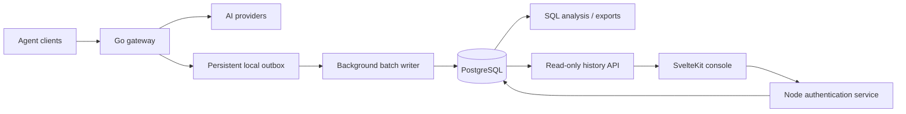

# Conversation recording design

Status: proposed architecture; conversation persistence is not implemented yet.

## Decision

Use PostgreSQL as the queryable conversation archive and persistent management authentication store. Populate the archive with a dedicated recorder in the Go gateway. Keep the SvelteKit frontend out of the recording path. Use a persistent local outbox to decouple capture from database availability, then ingest records in batches with idempotent replay.

The initial workload is five top-level agents running continuously, with an unknown number of subagents. This does not establish a request rate or payload size. Start with one PostgreSQL service on SSD storage; measure actual ingest and query workloads before introducing a separate analytical database.

The repository already includes pgx. The existing PostgreSQL store is for configuration, credentials, and cooldowns. Conversation recording needs a separate configuration section, schema, connection pool, and database role; enabling it must not change the credential storage backend. Persistent management authentication uses the same PostgreSQL instance with a distinct schema and connection pool.

## Persistent management authentication

Replace the Node process's in-memory session map with PostgreSQL-backed users and sessions:

- `auth.users`: stable UUID, login name, password hash, enabled state and credential version. Keep the current strong scrypt parameters; never store plaintext passwords.
- `auth.sessions`: hash of a cryptographically random cookie token, user ID, issue/expiry timestamps and revocation state. Store only the token hash. Preserve secure, HttpOnly, SameSite cookies and enforce expiry during every authenticated request, independently of cleanup jobs.
- Shared login-throttle state or an equivalent centralized admission mechanism, so running multiple Node instances cannot multiply the allowed password attempts.
- An explicit bootstrap command creates the initial operator account. Existing `AUTH_PASSWORD_HASH` can be imported once; restarting a process must not reset a changed password or recreate a disabled account.
- Logout revokes the database session. Password reset, credential-version changes and user disablement invalidate existing sessions. Database-backed sessions survive process restarts without extending their original lifetime.
- The Node server validates sessions through a small, separate pool. If authentication storage is unavailable, protected management access fails closed with a temporary-unavailability response. The Go recorder may continue buffering locally during the same outage.

This makes authentication compatible with multiple management frontend instances once their settings and trusted reverse-proxy configuration are consistent. A database outage still affects sign-in/session validation; separate pools prevent ingestion from consuming all auth connections but do not isolate CPU, disk or whole-server failures.

Use distinct database roles for auth, recorder ingestion, and read-only analysis. Analytical access must not grant access to user/password/session tables. Provider OAuth credentials and the existing Go client API-key configuration remain in their current stores during this change; moving either into a new database registry is a separate migration with revocation and compatibility implications. Log attribution can assign durable key IDs without changing where Go validates those keys.

## Data flow

The gateway captures immutable events while processing requests. It never makes a database round trip for each token. Large bodies and streams are written incrementally, not retained as whole conversations in memory. The batch writer owns its own lifecycle context; client disconnection must not cancel persistence.

Use an embedded SQLite WAL outbox with `synchronous=FULL` on a persistent local volume rather than inventing a journal format. One writer batches local transactions; committed outbox records survive process restarts. SQLite is an implementation detail of buffering, not a second externally operated database. Remove records only after PostgreSQL confirms its transaction committed. Unique event IDs make replay safe if a crash happens between the database commit and the outbox checkpoint.

## Capture semantics and reliability

- Record request start, ordered content/events, upstream attempts, usage, and terminal state. Preserve completed, failed, canceled, and interrupted requests.
- Capture original client requests and client-visible responses, plus structured provider-attempt metadata. Preserve protocol-specific fields. Do not concatenate repeated request histories into a fabricated transcript.
- Capture JSON responses, SSE, tool calls/results, and individual WebSocket turns. A socket connection can contain many requests. Realtime audio/video requires explicit transport integration; HTTP middleware alone is insufficient.
- Store payload bytes separately from indexed metadata, in compressed chunks. Normalize messages and tool events asynchronously for analysis, with a parser version and parse-error status. Preserve the original capture even when normalization fails.
- Preserve media supplied through the gateway. Record external media references as references; do not automatically fetch arbitrary URLs or claim their contents were archived.
- Never silently sample, truncate, or discard authenticated conversations. Batch sizes and chunk sizes control resource use, not accepted request size.

For the requested complete-history behavior, use durable capture: acknowledge request capture before dispatch upstream and persist response data before forwarding that data to the client. Group commits can amortize local sync overhead across concurrent requests, but this adds some latency. Measure it. Database writes remain asynchronous.

If PostgreSQL is unavailable, keep recording into the local outbox and replay later. If local durable storage becomes unwritable or exhausted, reject new generations and explicitly interrupt recording-dependent streams rather than silently claim complete history. Already committed partial records remain available. This policy prioritizes complete recording over uninterrupted inference when all persistence is unavailable; an optional availability-first mode would have to report explicit recording gaps.

Graceful shutdown stops admission, drains producers, awaits final usage events, commits local records, checkpoints completed database ingestion, and closes resources. Pending durable records may remain for restart replay. Local durability does not protect against losing the host or disk; database backups and resilient storage remain separate operational concerns.

## Identity

- Assign a full UUID to every logical request, upstream attempt, connection, and event. The current short display log ID is not a database key.
- Associate each request with the authenticated downstream principal, never a client-supplied claim about which API key was used.
- Store a keyed HMAC fingerprint of the client key, a stable database key ID, and an operator label. Do not store the raw client key, Authorization headers, cookies, or upstream secrets. Keep the fingerprint secret stable and backed up; support deliberate mapping when keys rotate.
- Keep the client identity separate from upstream credential IDs, which identify the provider account used for an attempt.
- Reuse the existing session extraction for Claude/Codex/generic clients, including parent sessions, forks, and subagents. Namespace session identifiers by authenticated principal and record whether grouping was explicit or inferred.
- Preserve response IDs and previous-response links. Missing session information produces ungrouped requests, not a guess that every request using one API key belongs to one conversation.

One labeled client key per top-level agent or workload makes attribution useful. Subagent hierarchy additionally requires session/parent metadata from the client. The gateway cannot see local agent actions, tool execution, or traffic sent directly to providers unless those results or requests subsequently pass through it.

## Logical schema

| Entity           | Purpose                                                                                                                                 |
| ---------------- | --------------------------------------------------------------------------------------------------------------------------------------- |
| `client_keys`    | Stable identity, fingerprint, label, rotation relationship; no key material                                                             |
| `conversations`  | Principal-scoped session, parent/root relationships, agent/client identity, grouping provenance                                         |
| `requests`       | Logical request UUID, conversation/key, endpoint, protocol, requested model, timestamps, final status, latency and capture completeness |
| `attempts`       | Request reference, attempt UUID/order, provider/model, upstream credential ID, usage, TTFT, status and retry reason                     |
| `events`         | Stable event UUID and request/connection sequence, direction, event kind, timestamps and payload references                             |
| `payload_chunks` | Compressed original bytes, ordering, encoding, checksum and size                                                                        |
| `messages`       | Versioned derived messages/tool calls/content references for analysis, preserving order and repeated inputs                             |

Use typed columns for common analytical dimensions and JSONB for variable, selected metadata. Do not serialize existing usage records wholesale: their `APIKey` and `Source` fields can contain secrets. Provider-returned usage remains distinguishable from estimates, and absent usage remains unknown rather than zero.

Index client key/time, conversation/order, and request/attempt identity first. Add targeted metadata indexes based on actual queries; avoid blanket indexes over raw prompts and responses. Use batched inserts initially; for larger batches, COPY into a staging table followed by idempotent inserts in one transaction preserves replay semantics. Keep database durability enabled.

Partition large append-only history by time when justified by measured volume. Retention is operator-controlled and defaults to no automatic deletion because no retention period has been requested. Payload, event, message, and metadata retention must remain consistent, and deletion must account for replay and shared content references.

## Capacity example, not a forecast

If each of five top-level agents averages one request every ten seconds, that is 43,200 requests/day before subagents:

- At 256 KiB captured per request: about 10.5 GiB/day, or 316 GiB per 30 days.
- At 1 MiB captured per request: about 42.2 GiB/day, or 1.24 TiB per 30 days.

These figures exclude indexes, derived data, replication and backups, and precede compression. Repeated histories can dominate volume. Measure bytes/request and compression on actual traffic; add content deduplication or object-backed payload storage if measurements justify it. Do not assume five agents means a small archive.

## Existing integration points

- `internal/api/server_middleware.go`: authenticated client principal and metadata.
- `sdk/api/handlers/handlers_interceptors.go`: existing logical request UUID and lifecycle; extend built-in capture without making recording depend on third-party plugins.
- `sdk/api/handlers/handlers_execution.go` and `handlers_stream.go`: downstream request/response and completion boundaries.
- `internal/runtime/executor/helps/logging_helpers.go` and `usage_helpers.go`: upstream attempts and usage; propagate shared request/attempt IDs.
- `sdk/api/handlers/openai/openai_responses_websocket.go`: per-message/turn WebSocket capture.
- `internal/client/codex/live/`: realtime media/sideband paths need separate coverage.
- `sdk/cliproxy/service_lifecycle.go`: recorder start, shutdown and replay lifecycle.

Do not build archival ingestion by polling `/usage-queue`: its backing queue is in-process memory with destructive consumption, expiration, and subscriber loss. Existing streaming file logging can also drop chunks. Both paths are useful telemetry references, not complete-history guarantees. Durable recording must have its own enablement, independent of debug/request-log and usage-statistics toggles.

Session extraction notes say hierarchy ownership moved to CLIProxyAPIHome. Implementation must check whether adding or changing shared event/session metadata requires corresponding Home updates; do not change existing Home queue behavior to provide this archive.

## Implementation and acceptance

1. Add PostgreSQL deployment/migrations and persistent management users, sessions, bootstrap and shared login throttling. Keep auth and recording database roles/pools separate.
2. Add recorder configuration, stable identity, local outbox, batch ingestion, replay and health metrics.
3. Integrate HTTP/JSON/SSE, authentication, provider attempts and usage. Integrate supported WebSocket/realtime paths before advertising all-transport capture.
4. Add message normalization, analytical SQL views and export. Keep canonical capture available when parser support is incomplete.
5. Add management history browsing separately; the UI only queries the authenticated backend.

Acceptance tests must cover PostgreSQL outage and recovery, crash/restart replay, duplicate replay, local write failure, request cancellation, partial SSE, multiple WebSocket turns, retries without duplicate user turns, key rotation, session collisions across keys, absent usage, large/multimodal bodies, redaction of auth material, and graceful shutdown. Benchmark added latency and sustained capture with representative long agent histories while analysis queries run. End-to-end tests must use a real PostgreSQL instance, not only mocked database calls.

Authentication tests must verify restart persistence, expiry, revocation across two Node instances, password changes, disabled users, shared throttling, bootstrap idempotence, and fail-closed behavior during database outages. Preserve the existing CSRF and secure-cookie tests.

Expose outbox bytes/oldest age, ingestion delay, failed writes, capture completeness, and database size so an unattended deployment has visible recording health. Use a read-only database role for analysis tools and keep the database on the private network.

## References

- [PostgreSQL JSON types and indexing](https://www.postgresql.org/docs/current/datatype-json.html)
- [PostgreSQL bulk loading](https://www.postgresql.org/docs/current/populate.html)
- [PostgreSQL partitioning](https://www.postgresql.org/docs/current/ddl-partitioning.html)
- [SQLite WAL concurrency and durability](https://www.sqlite.org/wal.html)
- [ClickHouse asynchronous insertion](https://clickhouse.com/docs/concepts/features/operations/insert/asyncinserts)

PostgreSQL is the starting recommendation because it supports flexible metadata queries, joins and transactional replay with a driver already present in this repository. SQLite is appropriate for the single-writer local outbox. Reconsider ClickHouse as an analytical destination if measured archive size and aggregation workloads outgrow PostgreSQL; it is not required merely because five agents run continuously.
